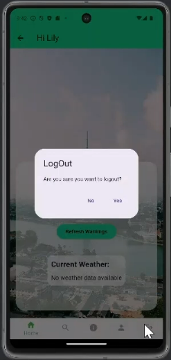

# SmartDengue Alert

## About Us
We are a group of passionate undergraduate developers working on innovative solutions for dengue alerts.

## Description
SmartDengue Alert is a mobile application designed to predict and prevent Dengue outbreaks in the Colombo district using machine learning & data science. Utilizing machine learning techniques and real-time data, the app provides early warnings and preventive measures to users, helping reduce the impact of Dengue on communities.

## Projects
- **SmartDengueAlert-frontend**: A Flutter-based frontend application providing a user-friendly interface for monitoring and receiving Dengue alerts.
- **SmartDengueAlert-backend**: A robust backend developed using Node.js and MongoDB, responsible for handling data storage, user management, and API services.
- **SmartDengueAlert-Python-ML-Server**: A Python/Flask server that integrates machine learning models to analyze data and predict potential Dengue outbreaks.

## Screenshots of the app
### Splash screen

### Login page

### Profile page

### Home page

### Search page

### Info page

### FAQ page

### Logout

## 🖊️ Cheers,
The SmartDengue Alert Team

---

Thank you for visiting our organization!
